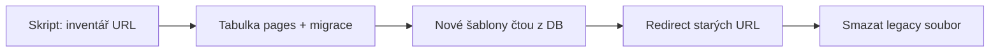

# Návrh kostry a směr refaktoru

> Poslední aktualizace: 2026-06-18  
> Status: **schválený směr** (rozhodnutí zadavatele + architekt)

## Shrnutí jednou větou

**Nové URL, nová kostra, obsah do DB, vlastní hledání — starý `system/*.php` neobalovat, ale nahradit (automatická extrakce + QA v prohlížeči). Vzhled a CSS až v další vlně.**

---

## Rozhodnutí (2026-06)

| Téma | Rozhodnutí |
|------|------------|
| URL | **Nové hezké URL** (`/cz/...`, `/en/...`), staré → 301 redirect |
| Vzhled | **Později** — teď jednoduchá kostra, ne držet staré CSS jako dogma |
| Starý kód | **Nahradit**, ne dlouhodobě obalovat; `system/` → postupně `legacy/` |
| Aktuality | **Ne lightbox** — seznam na homepage + vlastní stránka detailu |
| Hledání | **Vlastní** nad DB (stránky, aktuality, normy) |
| Tempo | **Víc najednou v základu** (router, DB, layout, search), méně „obalit a nechat“ |
| Prozkoumávání starých PHP | **Ty nemusíš** — inventář a extrakce udělá skript, ty/kolega jen kontrola na stagingu |

---

## Proč ne „nejdřív obalit staré funkce“

Minulá zkušenost se stejným autorem: většina `system/**/*.php` je `echo` HTML bez logiky — **obalení jen prodlužuje život něčeho, co stejně půjde pryč**.

**Lepší cesta k cíli (admin + DB):**



**Most jen dočasně:** pokud stránka ještě není v DB, jeden fallback route zobrazí „stránka se migruje“ nebo dočasně načte legacy — ne 80 obalů navždy.

---

## Nové URL (návrh)

Formát: `https://new.svuom.cz/{lang}/{cesta}`

| Příklad | Obsah |
|---------|--------|
| `/cz/` | homepage |
| `/en/` | homepage EN |
| `/cz/aktuality` | seznam aktualit |
| `/cz/aktuality/123-nazev` | detail aktuality (id + slug) |
| `/cz/aktivity/akrzk` | stránka (odpovídá dnešnímu `zobraz=akrzk`) |
| `/cz/kontakty` | kontakty |
| `/cz/hledat?q=koroze` | výsledky hledání |

**Technicky:** Apache `RewriteRule` → `index.php` (front controller).  
**SEO:** tabulka `redirects` — `index.php?zobraz=akrzk&lang=cz` → `/cz/aktivity/akrzk` (301).

Jazyk v URL (`cz` / `en`) odpovídá dnešnímu `lang` — neměníme zvyk zadavatele.

---

## Layout (kostra) — jednoduše

Jeden hlavní layout + varianta homepage. **Bez lightboxu aktualit.**

```
┌─ staging pruh (jen new.svuom.cz)
├─ header: logo | jazyk | HLEDÁNÍ (form → /cz/hledat)
├─ hlavní menu (dnes menutop — obsah z config/DB později)
├─ breadcrumb (kromě home)
├─ main
│    home:   hero/logo oblast + „Poslední aktuality“ (5 z DB) + stávající taby/odkazy (dočasně)
│    jinak:  volitelný levý submenu + obsah stránky
├─ footer
└─ cookies/GDPR (zachovat funkční řešení)
```

### Aktuality (nově)

| Kde | Chování |
|-----|---------|
| **Homepage** | Blok „Aktuality“ — 5 nejnovějších: datum, nadpis, krátký úvod (ořez), odkaz **„Číst dál“** |
| **`/cz/aktuality`** | Paginovaný seznam |
| **Detail** | `/cz/aktuality/{id}-{slug}` — celý text, PDF, obrázek; normální stránka, ne popup |

Lightbox necháme jen pro **galerie obrázků** v textu (pokud bude potřeba), ne pro seznam novinek.

---

## Hledání

Obsahu je hodně → hledání musí být **centrální a v DB**, ne Atomz.

### Fáze 1 (dostatečná pro start)

- Jedno pole v hlavičce → `GET /{lang}/hledat?q=...`
- MySQL **FULLTEXT** nad:
  - `pages` (title, body_html) — migrované stránky
  - `informace` (title, topic) — aktuality
  - `norms` / `engnorms` (název, anotace dle sloupců)
- Výsledky: název, typ (stránka / aktualita / norma), úryvek, odkaz
- Minimum **3 znaky**, limit např. 50 výsledků

### Fáze 2 (volitelně později)

- Lepší relevance, synonyma, CZ/EN současně
- Admin: „co se indexuje“

**Důvod:** dokud je obsah v PHP souborech, hledání nemůže být spolehlivé → migrace do `pages` je priorita hned za aktualitami.

---

## Datový model (minimum)

### `pages` (nová)

| Sloupec | Účel |
|---------|------|
| `id` | PK |
| `slug` | URL segment |
| `lang` | `cz` / `en` |
| `type` | `page`, `activity`, … |
| `title` | H1 + `<title>` |
| `body_html` | obsah z WYSIWYG / migrace |
| `meta_description` | volitelné |
| `legacy_zobraz` | původní `?zobraz=` pro redirect a migraci |
| `published` | 0/1 |
| `updated_at` | |

### `redirects`

| `old_path` | `new_path` | `code` (301) |

### Stávající tabulky

- `informace` — rozšířit o `slug` (pro hezké URL detailu)
- `employee`, `norms`, `engnorms` — beze změny struktury zpočátku, hledání přes FULLTEXT

---

## Co s `system/*.php`

| Fáze | Akce |
|------|------|
| Teď | Nechat na místě, **nepřidávat** nové závislosti |
| Migrace | Skript vytáhne HTML z funkce → `pages.body_html` |
| Po ověření | Soubor přesunout do `legacy/` nebo smazat |
| Ty | **Nemusíš** procházet PHP — jen na stagingu kliknout „vypadá to OK?“ |

**Priorita migrace** (od zadavatele): aktuality → kontakty → normy → zbytek statických stránek.

---

## Plán implementace (rozhodnutí architekta)

**Jedna souvislá vlna „základ“**, ne deset malých obalů.

| Pořadí | Úkol | Výstup |
|--------|------|--------|
| **1** | Front controller + Apache rewrite + `config/routes.php` | nové URL fungují |
| **2** | `templates/layouts/default.php` + partials (header, menu, footer, search) | jedna kostra |
| **3** | SQL migrace: `pages`, `redirects`, `informace.slug` | schéma v DB |
| **4** | Aktuality: homepage blok + seznam + detail (bez lightboxu) | první viditelný win |
| **5** | Hledání FULLTEXT | nahradí Atomz |
| **6** | Skript inventáře + hromadná extrakce do `pages` | obsah z PHP |
| **7** | Redirect mapa + mazání legacy | čistý repo |
| **8** | CSS/design pass | až když obsah běží z DB |

Každý krok = deploy staging + krátká kontrola.

---

## Vzhled (CSS)

- Teď: **minimální** — nové šablony, dočasně mohou použít část starých barev (#08A9BF) aby to nebylo rozbité
- Později: `assets/css/` — tokens, komponenty, responzivita
- **Necíl:** pixel-perfect kopie starého layout.css v novém kódu

---

## Co od tebe potřebujeme

| Kdo | Co |
|-----|-----|
| **Ty** | Občas otevřít staging a říct „OK“ / „tady je rozbité“ |
| **Kolega** | Po migraci sekcí obsahový review |
| **Ne** | Ruční procházení `system/*.php` |

---

## Další krok v kódu

Začít **pořadím 1–2**: front controller, rewrite pravidla, prázdná kostra s menu a search formulářem — na stagingu uvidíš `/cz/` místo starého home.

Pokud souhlasíš, v další relaci (nebo po tvém „jeď“) implementujeme krok 1.

---

## Administrace — nová, ne rozšiřovat starou

### Co je dnes (`service/admin.php`)

| Modul | Co dělá | Stav kódu |
|-------|---------|-----------|
| Přihlášení | `users`, SHA1 heslo, session | zastaralé, SQL injection riziko |
| Aktuality | CRUD `informace`, upload PDF/obrázku | funkční pro kolegu, špatný kód |
| Kontakty | CRUD `employee` | totéž |
| Registrace / zapomenuté heslo | nový uživatel adminu | asi zřídka potřeba |

Stejný styl jako `index.php`: `?shw=informace&tsk=...`, `echo` HTML, `mysql_*`, lightbox.

### Rozhodnutí: **nový admin od nuly**

| | Starý `service/` | Nový admin |
|--|------------------|------------|
| Kód | nechat dočasně | `templates/admin/`, `app/Admin/` |
| URL | `service/admin.php?shw=...` | `/admin/` (hezké cesty) |
| Aktuality, kontakty | **přepsat** čistě | stejná DB tabulka, nové formuláře |
| Stránky, normy | neexistuje | nové moduly |
| WYSIWYG | textarea | TinyMCE (nebo podobný) |
| Hesla | SHA1 | `password_hash` + migrace při prvním loginu |

**Nesoupneme** funkce ze `informace.php` / `contact.php` do nového adminu — převezmeme jen **co mají dělat** (jaká pole, uploady), ne jejich implementaci.

### Přechod

1. Veřejný web (front) dřív nebo paralelně s adminem — obsah z DB.
2. Nový admin: nejdřív **aktuality** (parita se starým), pak **kontakty**, pak **stránky**, pak **normy**.
3. Starý `service/admin.php` necháme běžet, dokud nový nemá paritu pro kolegu.
4. Pak redirect `service/admin.php` → `/admin/` a `service/` do `legacy/`.

**Ty nemusíš** studovat starý admin — stačí říct, jestli kolega potřebuje ještě registraci nových uživatelů, nebo jen ty přidáváš účty.

